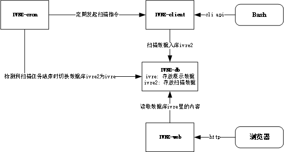

# IVRE网络侦察自动化
该项目基于 [IVRE](https://github.com/ivre/ivre) 实现自动化的扫描任务，定期对目标网络资产进行扫描。IVRE 是一个开源的网络资产识别软件，是一个集成化的扫描工具，同时提供WEB UI供使用者检索定位资产。

## 支持特性
- 资产入口支持纯 IP 地址、CIDR、文本文件
- 可自定义端口，兼容 nmap 定义的端口格式
- 可自定义扫描模版，即扫描策略
- 定时执行扫描任务
- 断点续扫
- 实时呈现最近一次完整扫描结果
- 留存扫描原始数据
- IVRE 原生检索
- docker-compose 一键编排
- 支持 https 协议

## 运行原理
该项目依赖 ivre 和 cron ，同时确保访问 https://ivre.rocks/ 畅通，因为需要定期更新 IP 地址信息库。

整个系统分四个重要部件，分别是任务执行器（cron）、扫描客户端（client）、数据库（db）、web 展示端（web）。

- **任务执行器（cron）:** 默认每周下达一次 IP 地址信息库更新和一次扫描指令；同时每分钟进行侦测扫描任务是否完成，若有完成，执行数据库切换操作，即将临时数据库 ivre2 导入到展示数据库 ivre 中，供生产使用。
- **扫描客户端（client）:** 在收到 IP 信息库更新指令后从 https://ivre.rocks/ 站点下载最新 IP 数据库；在接收到扫描指令后读取资产信息，并对其实施扫描，扫描中的数据存放至名为 ivre2 的临时数据库，扫描完成后，在与 cron 一个共享目录创建 .done 文件，告知 cron 任务已完成。
- **web展示端（web）**: 提供数据检索及可视化，供消费者直观使用。

	


## 快速开始
1. 安装好 docker 和 docker-compose
- docker 安装可参考: https://docs.docker.com/engine/install/
- docker-compose 安装可参考: https://docs.docker.com/compose/install/
2. 克隆项目到本地，并切换工作目录到 ivre 下
	```bash
	git clone https://github.com/evling2020/ivre
	cd ivre
	```
3. 预定资产信息，编辑扫描客户端资产定义文件`client/data/assets.txt `，如下为示范内容：
	```bash
	10.66.1.0/24;;net_mgr;intranet
	10.67.1.0/24;;internal;intranet
	10.69.1.0/24;;backup;intranet
	10.70.1.0/24;;test_lan;intranet
	172.16.1.0/24;;vulhub_lan;intranet
	10.70.4.0/24;;test_lan;intranet
	10.8.5.0/24;;dmz;intranet
	10.66.9.0/24;;net_mgr;intranet
	10.67.9.0/24;;internal;intranet
	#10.69.9.0/24;;backup;intranet
	#10.68.15.0/24;;share_center;intranet
	#10.69.15.0/24;;backup;intranet
	#192.168.15.0/24;;kernel_lan;intranet
	#172.16.44.0/24;;vpn_lan;intranet
	#10.8.0.1/32;dmz;;intranet
	#10.8.0.254/32;;dmz;intranet
	#192.168.1.0/24;;wifi_lan;intranet
	#192.168.2.0/24;;guest_lan;intranet
	#/data/1.txt;80,443,8080,8443,1194;test_lan;intranet
	#8.8.8.8;;test_dns;extranet
	```

	文件分四列，每列含义如下：
	- 第一列: IP 信息，包含 IP 地址、CIDR或者 IP 文本
	- 第二列: 端口信息，如`1-65535`、`80,443,8080,8443,1194`、`1-1000,10000-20000`等 nmap 支持的形式即可
	- 第三列: 资产所在区域信息，如 dmz 、internal、wifi_lan
	- 第四列: 内外网信息，这里就定义的内网和外网，可按需自行定义。
	> **注意事项:** # 号表示注释，不对该行资产进行扫描

4. 预定扫描模板，编辑扫描模板文件 `client/data/ivre.conf` ，数据库信息不要乱动，可修改模版 `NMAP_SCAN_TEMPLATES["ivre-scan"]` 部分的内容，具体定制可参考文档 [Nmap scan templates](https://doc.ivre.rocks/en/latest/install/config.html#nmap-scan-templates) 。

	```bash
	DB = "mongodb://ivre_db_1/ivre2"
	NMAP_SCAN_TEMPLATES["ivre-scan"] = NMAP_SCAN_TEMPLATES["default"].copy()
	NMAP_SCAN_TEMPLATES["ivre-scan"]["ports"] = "1-65535"
	NMAP_SCAN_TEMPLATES["ivre-scan"]["scripts_categories"] = ['(default or discovery or auth) and not (broadcast or brute or dos or exploit or external or fuzzer or intrusive)']
	NMAP_SCAN_TEMPLATES["ivre-scan"]["scripts_exclude"] = []
	```
5. 制定扫描计划任务，编辑当前目录下的 `docker-compose.yml` 文件 cron 容器部分，修改执行策略为你想要的周期即可，这里默认的是北京时间每周一上午 7 点更新 IP 地址库，每周一上午八点执行一次扫描任务。
	```bash
	...
	cron:
		# This containers handles crontabs for the other containers, following the 1 task per container principle.
		# It is based on  `docker:latest` image, wich is an alpine image with docker binary
		build: ./cron
		command: [sh, -c, "/bin/sh /cron/entrypoint.sh && echo -e '0 7 * * 1        docker exec -itd ivre_client_1 /bin/bash -c \"/usr/local/bin/ivre ipdata --download >> /var/log/ivre.log 2>&1\"\n* * * * *        /usr/local/bin/docker exec -itd ivre_client_1 /bin/bash -c \"/bin/bash /data/scan.sh >> /var/log/ivre.log 2>&1\"\n0 8 * * 1       /bin/sh /cron/scan.sh' > /etc/crontabs/root && crond -f -l 8"]
	...
	```
6. 修改 nginx 配置信息，如有必要，建议替换如下 ssl 证书及密钥文件为实际的文件，并修改 `web/default` 的服务器域名 `localhost` 为实际域名。
	- web/ssl/server.crt
	- web/ssl/server.key
8. 拉起容器，等待镜像下载完成及容器、网络均已创建完成，即可通过https://your_domain 访问， Just enjoy IT！
	```bash
	docker-compose up -d
	```
9. 手工触发扫描，有些同学在制定好任务后，想立即体验下效果，但不想去修改任务，那这里提供一个手动执行的办法
	```bash
	docker exec -itd ivre_client_1 /bin/bash -c "/bin/bash /data/scan.sh >> /var/log/ivre.log 2>&1"
	```
	然后就是等待任务完成，直到能看到数据为止。
	
## 效果展示
- 资产罗列页
	

- 详情页
	

- 检索效果页
	按`cpe:a:openbsd:openssh:8.8p1`进行检索
	


## 法律免责声明
该项目仅用于公司或者家庭内部网络的扫描，若用于未经授权的外部扫描属于非法行为，后果自负。

## TODO
- [ ] 访问认证
- [ ] 流量地图

## 更新日志
- **2022.02.26:** 首次创建项目

## 易雾山庄

该项目是易雾山庄-家庭基建的一部分，[**易雾山庄**](https://www.evling.tech)记录了家庭网络基础建设的种种实践，可以帮助更多有需要的人减少折腾。希望通过这个平台构建一只家庭基建小社群，共同优化我们的生活体验，增强个人数据安全保护意识，同时我们还要考虑环保节能问题，实实在在帮大家伙组建属于自己的家庭网络。欢迎关注微信公号《易雾山庄》，订阅易雾君的独家折腾！！！


